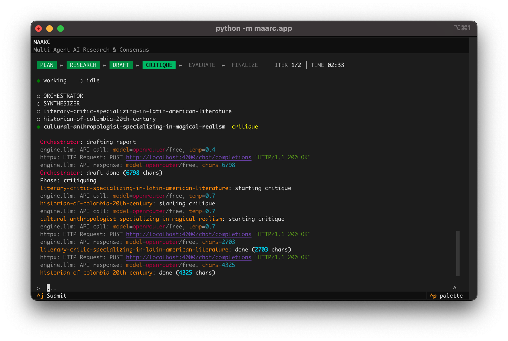
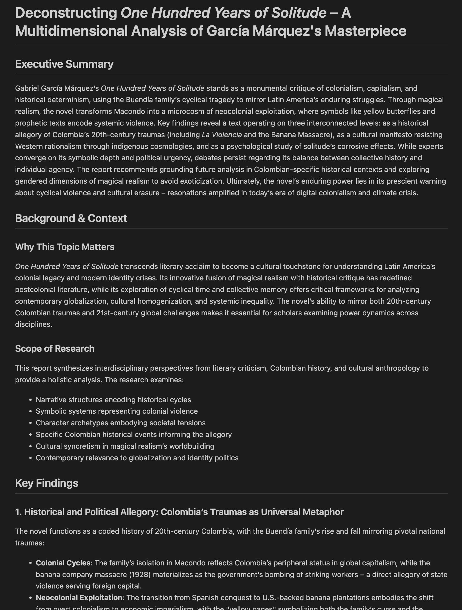

# MAARC - Multi-Agent AI Research & Consensus

Iterative Multi-Agent Research Engine with debate-based consensus building.

## Overview

MAARC is a terminal-based application that conducts deep research through iterative debate between dynamically spawned AI agents. It features a feedback loop architecture with parallel agent execution, Human-in-the-Loop (HITL) checkpoints, and model-agnostic routing via LiteLLM.




---
## Features

- **Dynamic Agent Teams**: The Orchestrator analyzes your topic and spawns domain-specific experts (not fixed roles)
- **4-Phase Iterative Workflow**:
  1. **Planning**: Orchestrator proposes a team of experts for your topic
  2. **Research**: All agents conduct research in parallel
  3. **Drafting**: Orchestrator synthesizes findings into a comprehensive draft
  4. **Critique**: All agents critique the draft
  5. **Synthesis**: Dedicated Synthesizer agent produces the final polished report
- **Human-in-the-Loop**: Approve/modify the agent team before research begins
- **Multi-Model Support**: Agents can be sourced from a pool of LLM API provider, including local models.
- **Autonomous Web Search**: Dynamic tool calling allows agents to ground their research with real-time web results from DuckDuckGo.
- **Rich TUI**: Beautiful terminal interface with real-time agent status, phase tracking, and word-wrapped logs
- **Markdown Reports**: Generate comprehensive research reports with optional development appendices

## Architecture (V2)

```
┌─────────────┐    ┌─────────────┐    ┌─────────────┐
│  Orchestrator│───▶│   Agents    │───▶│  Draft Report│
│ (Team Planner)│    │  (Parallel) │    │(Synthesized) │
└─────────────┘    └─────────────┘    └──────┬──────┘
                                              │
       ┌──────────────────────────────────────┘
       ▼
┌─────────────┐    ┌─────────────┐    ┌─────────────┐
│   Agents    │───▶│  Evaluation │───▶│  Synthesizer │
│  (Critique) │    │  (Loop/End) │    │(Final Report)│
└─────────────┘    └─────────────┘    └─────────────┘
```

### Tool Calling & Grounding
MAARC agents utilize **Autonomous Tool Calling** to interact with external data sources. When search is enabled, agents can dynamically decide to query the web for up-to-date facts. The engine implements an adapter pattern, allowing you to swap search providers (e.g., DuckDuckGo, SearXNG) through simple configuration.

## Installation

```bash
# Clone the repository
git clone <repository-url>
cd maarc

# Create virtual environment (recommended)
python -m venv .venv
source .venv/bin/activate  # On Windows: .venv\Scripts\activate

# Install dependencies
pip install -r requirements.txt

# Or install as editable package
pip install -e .
```

## Configuration

Copy the example configuration and edit `config.yaml`:

```bash
cp config.yaml.example config.yaml
```

Key configuration sections in `config.yaml`:

### Model Providers
Configure multiple providers and switch between them:

```yaml
models:
  providers:
    openai:
      enabled: true
      api_base: "https://api.openai.com/v1"
      api_key: "${OPENAI_API_KEY}"
      default_model: "gpt-4o"
    
    anthropic:
      enabled: true
      api_base: "https://api.anthropic.com"
      api_key: "${ANTHROPIC_API_KEY}"
      default_model: "claude-3-5-sonnet-20241022"
    
    local-ollama:
      enabled: true
      api_base: "http://localhost:11434"
      api_key: "ollama"
      default_model: "llama3.1"
```

### Agent Routing
Assign different providers to different components:

```yaml
# Orchestrator plans the team and manages workflow
orchestrator:
  provider: openai
  temperature: 0.7
  team_generation:
    min_agents: 2
    max_agents: 5
    require_skeptic: true

# Synthesizer produces the final report
synthesizer:
  provider: anthropic
  temperature: 0.3

# Spawned agents use this default
agents:
  default:
    provider: openai
```

### Research Parameters

Configure how the engine debates and reaches a conclusion:

```yaml
research:
  max_iterations: 2        # Maximum debate cycles
  consensus_threshold: 0.85
  
  web_search:
    enabled: true        # Enable web search for agents
    provider: duckduckgo # Current supported: duckduckgo
    max_results: 5       # Max snippets per search
```

### Human-in-the-Loop

```yaml
human_in_the_loop:
  enabled: true            # Enable team approval prompt

output:
  directory: reports       # Where to save reports
```

## Usage

### Set API Keys

```bash
export OPENAI_API_KEY=your_key_here
export ANTHROPIC_API_KEY=your_key_here
# Or use a .env file
```

### Run the TUI Application

```bash
# Launch the interactive terminal UI
python -m maarc

# Or via main.py
python main.py
```

### Interactive Workflow

1. **Enter Topic**: Type your research question and press `Ctrl+J`
2. **Approve Team**: Review the dynamically generated expert team
   - Type `y` to approve
   - Type `add <role>` to add an expert (e.g., `add Security Expert`)
3. **Monitor Progress**: Watch real-time updates as agents research and critique
4. **View Report**: Final report is saved to `reports/` directory

### Keyboard Shortcuts

| Key | Action |
|-----|--------|
| `Ctrl+J` | Submit input |
| `Ctrl+C` or `q` | Quit |
| `c` | Copy log to clipboard |
| `^` button | Expand/collapse input area |

## Output

Reports are saved to the `reports/` directory as Markdown files with:
- YAML frontmatter (topic, iterations, team, consensus status)
- Professional final report (synthesized from all research)
- Optional development appendices (draft report, critiques, raw outputs)

To toggle development appendices, edit `engine/v2/graph.py`:

```python
# Line 43
INCLUDE_DEV_APPENDICES: bool = False  # Set to False for production
```

## Development

### Project Structure

```
maarc/
├── maarc/              # TUI application
│   ├── app.py          # Main Textual app
│   ├── layout.py       # UI widgets
│   ├── bridge.py       # Async research bridge
│   └── hub.py          # Event hub for UI updates
├── engine/v2/          # Research engine
│   ├── graph.py        # LangGraph workflow
│   ├── nodes.py        # Agent nodes (Orchestrator, Agents, Synthesizer)
│   ├── state.py        # State definitions
│   └── cli.py          # CLI entry point
├── engine/models/      # LLM client
├── config.yaml         # Configuration file
└── reports/            # Generated reports
```

### Running Tests

```bash
python -m pytest test_v2.py -v
```

## Requirements

- Python 3.11+
- API key for at least one provider (OpenAI, Anthropic, or local Ollama)

## License

[MIT]
